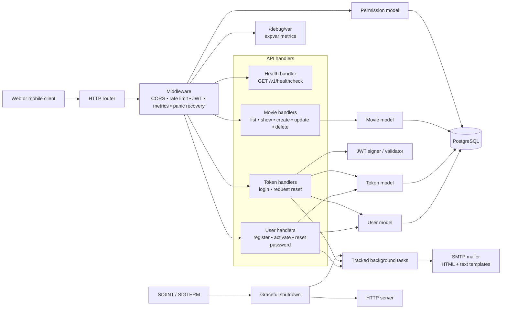

# Movie API

A Go REST API for managing movies and users. It demonstrates JWT authentication, database permissions, PostgreSQL, asynchronous email, rate limiting, metrics, and graceful shutdown in a small, readable service.

## Architecture



## Features

- Movie CRUD with title search, genre filters, pagination, sorting, and optimistic locking.
- JWT access tokens signed with HMAC-SHA256 and checked for expiry, issuer, audience, and user identity.
- Bcrypt password hashing and account activation by email.
- Password reset with one-time, expiring, database-backed tokens.
- Background email delivery with embedded HTML and plain-text templates.
- Graceful `SIGINT`/`SIGTERM` shutdown that finishes active requests and tracked background work.
- Permission-based access control: `movies:read` and `movies:write`.
- JSON validation, 1 MiB request limits, unknown-field rejection, and consistent error responses.
- Per-IP token-bucket rate limiting and configurable CORS.
- `expvar` metrics for requests, status codes, timing, goroutines, database stats, and version.

## API endpoints

Base URL: `http://localhost:4000`

| Method   | Endpoint                    | Description                                    | Permission                      |
| -------- | --------------------------- | ---------------------------------------------- | ------------------------------- |
| `GET`    | `/v1/healthcheck`           | Service status and version.                    | Public                          |
| `POST`   | `/v1/users`                 | Register a user and queue an activation email. | Public                          |
| `PUT`    | `/v1/users/activated`       | Activate an account with an activation token.  | Activation token                |
| `PUT`    | `/v1/users/password`        | Set a new password with a reset token.         | Reset token                     |
| `POST`   | `/v1/tokens/authentication` | Return a 24-hour JWT for valid credentials.    | Public                          |
| `POST`   | `/v1/tokens/password-reset` | Queue password-reset instructions by email.    | Public                          |
| `GET`    | `/v1/movies`                | Search and list movies.                        | `movies:read` + activated user  |
| `GET`    | `/v1/movies/:id`            | Get one movie.                                 | `movies:read` + activated user  |
| `POST`   | `/v1/movies`                | Create a movie.                                | `movies:write` + activated user |
| `PATCH`  | `/v1/movies/:id`            | Update a movie.                                | `movies:write` + activated user |
| `DELETE` | `/v1/movies/:id`            | Delete a movie.                                | `movies:write` + activated user |
| `GET`    | `/debug/var`                | View runtime and application metrics.          | Public; protect in production   |

Protected routes use:

```http
Authorization: Bearer <authentication_token>
```

New users receive `movies:read`. Grant `movies:write` through the `users_permissions` table

## Packages used

| Package                                                       | Purpose                          |
| ------------------------------------------------------------- | -------------------------------- |
| [httprouter](https://github.com/julienschmidt/httprouter)     | HTTP routing and path parameters |
| [lib/pq](https://github.com/lib/pq)                           | PostgreSQL driver                |
| [pascaldekloe/jwt](https://github.com/pascaldekloe/jwt)       | JWT signing and validation       |
| [wneessen/go-mail](https://github.com/wneessen/go-mail)       | SMTP email delivery              |
| [golang.org/x/crypto](https://pkg.go.dev/golang.org/x/crypto) | Bcrypt password hashing          |
| [golang.org/x/time](https://pkg.go.dev/golang.org/x/time)     | Rate limiter support             |
| [tomasen/realip](https://github.com/tomasen/realip)           | Client IP detection              |

The service also uses Go’s standard `net/http`, `database/sql`, `log/slog`, `expvar`, `context`, and `sync` packages.

## Run locally

Prerequisites: Go 1.27+, PostgreSQL, the `migrate` CLI, and an SMTP account such as Mailtrap.

Set local credentials without committing secrets:

```bash
export GREENLIGHT_DB_DSN='postgres://greenlight:<password>@localhost/greenlight?sslmode=disable'
export JWT_SECRET='<long-random-secret>'
```

Apply migrations and run the API:

```bash
migrate -path ./migrations -database "$GREENLIGHT_DB_DSN" up
make run/api
```

The default port is `4000`. SMTP, CORS, database pool, rate-limit, environment, and port settings are available as command-line flags:

```bash
go run ./cmd/api -help
```

Try the health check:

```bash
curl http://localhost:4000/v1/healthcheck
```

## Development

```bash
make tidy       # format and verify dependencies
make audit      # vet, staticcheck, and race-enabled tests
make build/api  # build the API binary
```

## Project layout

```text
cmd/api/          HTTP server, routes, handlers, middleware, lifecycle
internal/data/    PostgreSQL models, validation, tokens, permissions
internal/mailer/  SMTP client and embedded email templates
migrations/       Database migrations
```

## License

Released under the [MIT License](LICENSE).
